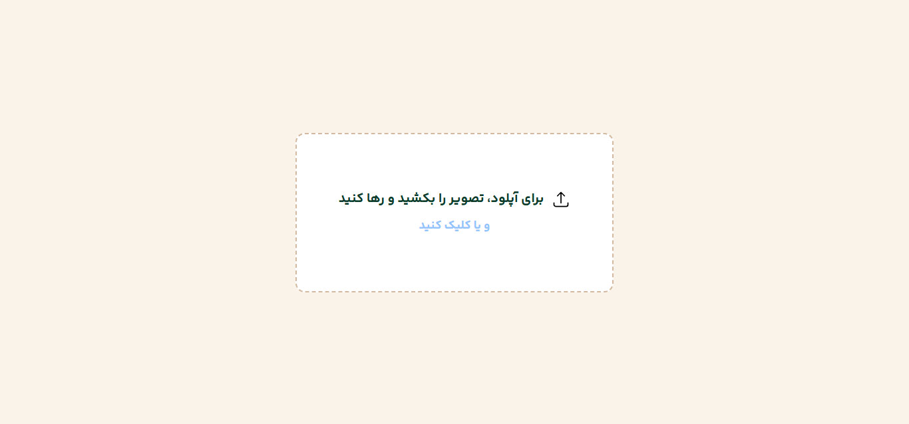

# Persian OCR
## This app uses [Tesseract.js](https://github.com/naptha/tesseract.js) to convert images to text

OCR is a revolutionary technology that helps preserve culture. It is a software that recognizes text from images. In other words, it converts images to text. This is useful for extracting valuable works from historic poets and writers.

### Hidden Input 
There is a hidden input with ```ref``` attribute that, when called, opens the file input:

```tsx
    <input
        accept=".png, .jpg" type="file" name="" id=""
        hidden ref={inputFileRef}
        onChange={(e: ChangeEvent<HTMLInputElement>) => {
            ...
        }}
    />
```

### User-Friendly Drag & Drop Box

A drag-and-drop box is located in the middle of the page:



- ```onDragOver```: This attribute triggers when a file is dragged over the element, allowing visual feedback (e.g., "Drop the file").

- ```onDragLeave```: This attribute resets the component when the user cancels the drag operation.

- ```onDrop```: This attribute processes the file when the user drops it successfully.

```tsx
    <div
        className=" ... "
        onClick={(e) => { ... }}
        onDragOver={(e) => { ... }}
        onDragLeave={(e) => { ... }}
        onDrop={(e) => { ... }}
    >
        ...
    </div>
```

### Handling Files (Input & Drop)

Both the file input and ```onDrop``` provide a file, which you pass to the OCR function:
```tsx
    // onDrop 
    onDrop={(e) => {
        e.preventDefault();
        const files = e.dataTransfer.files;

        if (files.length > 0) {
            const file = files[0];
            OCR(file)

            const fileURL = URL.createObjectURL(file); // For displaying the image
            setInputImage(fileURL)
            setPage("show")
        }
    }}

    // Input onChange
     onChange={(e: ChangeEvent<HTMLInputElement>) => {
        const files = e.target.files;

        if (files && files.length > 0) {
            const file = files[0];
            OCR(file);

            const fileURL = URL.createObjectURL(file); // For displaying the image
            setInputImage(fileURL)
            setPage("show");
        }
    }}
```
## What is the OCR Function?
> [!NOTE]
> We use [Tesseract.js](https://github.com/naptha/tesseract.js), a powerful library that supports **100+ languages** and works with many programming languages.

```tsx
    const OCR = async (Image: any) => {
        const worker = await createWorker("fas");
        const result = await worker.recognize(Image);
        setText(result.data.text);
        await worker.terminate();
    }
```

It returns the recognized text, which you can use anywhere.

To display the uploaded image, use:
 ``` URL.createObjectURL(file); ```

### Sharing & Copying Text

You can use the navigator API to interact with the user's device:

* Share text:
 ```navigator.share(...)```
 
* Copy text:
 ```navigator.clipboard.writeText(...)```
